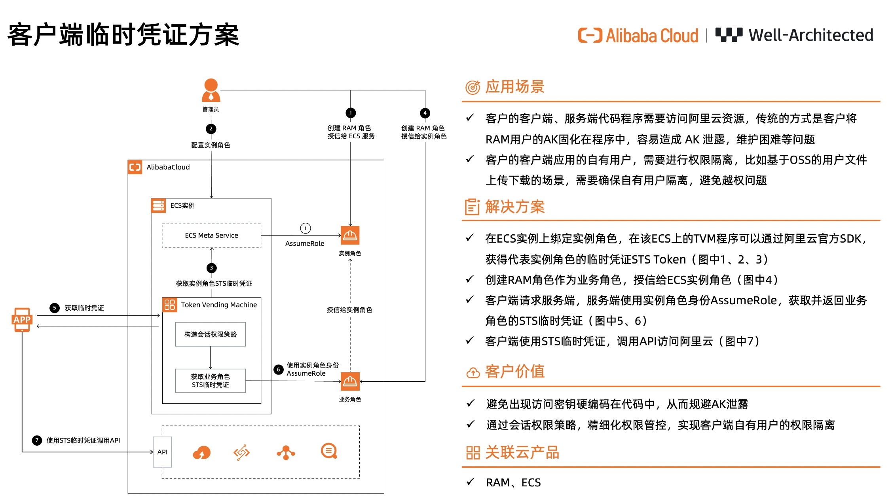

## 客户端临时凭证方案示例代码
该项目用于阿里云2024云栖大会期间，客户在云卓越架构展区，体验通过临时凭证访问阿里云服务。

### 简介
本实验可帮助您体验通过临时凭证访问阿里云，无需使用长期密钥，减少密钥泄露的风险。同时，通过会话权限策略，可以进行精细化的权限管控，避免越权问题。

### 方案架构图


### 代码结构
```
none-ak-demo/         
    ├── app-demo/ # 移动端应用示例代码
    └── token-vending-machine-demo/ # 服务端示例代码，用于签发临时凭证提供给移动端应用
```